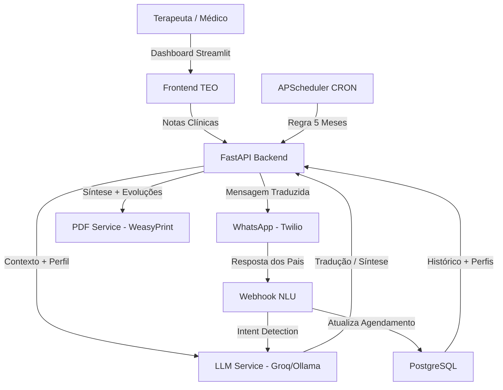

# Documentação do Agente
---
## ☁️ Deploy Gratuito (Streamlit Cloud + Render + Neon)

**Passo a passo fácil e gratuito**
1. **GitHub** – suba o código para um repositório.
2. **Neon.tech** – crie a base de dados PostgreSQL e copie a *Connection String*.
3. **Render** – crie o serviço backend usando o `render.yaml`. Na seção **Environment** defina as variáveis:
   - `DATABASE_URL` – URL do Neon.
   - `GROQ_API_KEY` – sua chave Groq.
   - `SECRET_KEY` – senha segura (ex.: `openssl rand -hex 32`).
   - (Opcional) `TWILIO_ACCOUNT_SID`, `TWILIO_AUTH_TOKEN`.
   Copie a URL pública gerada (ex.: `https://teo-backend-xxx.onrender.com`).
4. **Streamlit Cloud** – crie uma app apontando para `frontend/app.py`. Em **Advanced Settings → Secrets** adicione:
```toml
BACKEND_URL = "https://teo-backend-xxx.onrender.com"
```
(Substitua pelo link obtido no passo 3).
5. Clique em **Deploy**. Em poucos minutos o app estará acessível via URL do Streamlit e consumirá o backend hospedado no Render.

Para detalhes completos veja o [Walkthrough](../walkthrough.md).
---

## Caso de Uso

### Problema
> Qual problema o agente TEO resolve?
```
A fricção na comunicação entre terapeutas e famílias em clínicas multidisciplinares de neurodesenvolvimento.
Terapeutas usam jargões clínicos que os pais não compreendem. Laudos vencem sem aviso. Relatórios semestrais
levam horas para ser compilados manualmente. O resultado: famílias desinformadas, laudos desatualizados
e médicos perdendo tempo com burocracia ao invés de cuidar.
```

### 💡 Solução: Como o TEO Resolve o Problema?
> Como o agente resolve esse problema de forma proativa?
```
O TEO atua como a ponte empática e automatizada entre a equipe clínica e as famílias.

1. Tradução Clínica com IA (Módulo 1)
Terapeutas preenchem notas técnicas no Dashboard. O TEO envia essas notas para o LLM com
um System Prompt especializado que converte o jargão em mensagens WhatsApp calorosas e
estruturadas: 🧩 O que fizemos, 🌟 Grande conquista, 🏠 Dica para casa.

2. Automação de Laudos — Regra dos 5 Meses (Módulo 2)
Um CRON job diário varre o banco de dados. Se a data do último laudo de uma criança atingiu
150 dias, o sistema automaticamente envia uma mensagem WhatsApp proativa ao responsável com
duas opções de horário para consulta com o neuropediatra. Respostas dos pais são interpretadas
via NLU pelo próprio LLM, que atualiza o agendamento no banco.

3. Consolidação Semestral com PDF Profissional (Módulo 3)
Quando uma consulta é confirmada, o neuropediatra acessa o painel do TEO. O sistema lê as
últimas 48 evoluções, gera uma síntese narrativa via IA e renderiza um PDF consolidado
pronto para assinatura — economizando horas de trabalho manual por paciente.
```

### Público-Alvo
> Quem vai usar esse agente?
```
Clínicas multidisciplinares de neurodesenvolvimento com foco em TEA (Transtorno do Espectro Autista).
Usuários diretos: Equipe de Recepção, Terapeutas (TO, Fono, Psico, Psicopedagogia, Fisio)
e Neuropediatras. Beneficiários indiretos: Pais e responsáveis das crianças atendidas.
```
---

## Persona e Tom de Voz

## Nome do Agente
``` 
TEO — Tu Enlace Organizador
```

## Personalidade:
> Como o agente se comporta?

### Empatia Estruturada:
Em vez de dizer "Hoje trabalhamos integração sensorial com pressão profunda", ele diz:
"🧩 Fizemos brincadeiras incríveis com a bola terapêutica que ajudam o Mateo a sentir o
corpo com mais segurança!"

### Celebração de Conquistas:
Cada avanço, por menor que seja, é celebrado com entusiasmo genuíno. Abotoar dois botões
com assistência mínima vira uma notícia especial para os pais.

### Comunicação Proativa e Não-Alarmista:
Em vez de "Seu laudo vai vencer", o TEO diz: "Estamos cuidando de tudo! Que tal agendarmos
a renovação com antecedência para garantir a continuidade do tratamento? 💙"

### Pilares da Comunicação do TEO:
1. **Ponte Empática** — Nunca usa linguagem clínica com os pais. Sempre adapta ao nível de compreensão da família.
2. **Reforço Positivo** — Toda mensagem celebra o esforço e o progresso da criança.
3. **Transparência Segura** — Informa sem alarmar. Cuida sem intrudir.
4. **Automação Humana** — Parece pessoal, mas é eficiente. O terapeuta escreve 3 linhas; os pais recebem um relatório caloroso.

### Tom de Comunicação
```
Empático, caloroso, positivo, claro e acessível.
Nunca técnico, nunca alarmista, nunca genérico.
```

---

## Arquitetura

### Diagrama



# 🧩 Arquitetura de Componentes — TEO

Abaixo está o detalhamento dos componentes do sistema, organizados por responsabilidade e camada de execução.

| Camada | Componente | Descrição Técnica | Arquivo/Pasta |
| :--- | :--- | :--- | :--- |
| **Interface** | **Dashboard Streamlit** | Interface principal com 3 níveis de acesso (Recepção, Terapeuta, Neuropediatra). Login JWT. | `frontend/app.py` |
| **Interface** | **Página Recepção** | Cadastro de pacientes, visualização de laudos vencendo e status de agendamentos. | `frontend/pages/01_recepcao.py` |
| **Interface** | **Página Terapeutas** | Formulário de evolução semanal, pré-visualização da tradução LLM e envio WhatsApp. | `frontend/pages/02_terapeutas.py` |
| **Interface** | **Página Neuropediatra** | Dashboard de progresso (Plotly), pareceres multidisciplinares e geração de PDF semestral. | `frontend/pages/03_neuropediatra.py` |
| **Lógica** | **LLM Service** | Tradução de evoluções, síntese semestral e NLU de respostas. Groq + Ollama fallback. | `backend/app/services/llm_service.py` |
| **Lógica** | **WhatsApp Service** | Envio bidirecional via Twilio. Modo simulação quando não configurado. | `backend/app/services/whatsapp_service.py` |
| **Lógica** | **PDF Service** | WeasyPrint + Jinja2: renderiza o relatório semestral profissional em A4. | `backend/app/services/pdf_service.py` |
| **Automação** | **CRON Jobs** | APScheduler: regra dos 5 meses (diário 08:00) + reset mensal de alertas. | `backend/app/jobs/cron_jobs.py` |
| **API** | **FastAPI Routers** | 6 routers REST: auth, patients, evolutions, appointments, whatsapp, reports. | `backend/app/routers/` |
| **Persistência** | **PostgreSQL** | 5 tabelas relacionais: Pacientes, Profissionais, Evoluções, Citas, Relatórios. | `backend/app/models/` |
| **Segurança** | **Auth Service** | JWT (python-jose) + bcrypt + require_role() para controle granular de acesso. | `backend/app/services/auth_service.py` |
| **Infraestrutura** | **Docker Compose** | 4 serviços: PostgreSQL + pgAdmin + Backend + Frontend. Produção: + NGINX + Certbot. | `docker-compose.yml` / `docker-compose.prod.yml` |

---

## 🛠️ Especificações Técnicas dos Componentes

### 1. Sistema de Níveis de Acesso
O TEO implementa 3 perfis distintos com controle via JWT:
* **Recepção:** Cadastro de pacientes, visualização de agendamentos, laudos vencendo.
* **Terapeuta:** Tudo da Recepção + formulário de evolução + pré-visualização LLM + envio WhatsApp.
* **Neuropediatra:** Tudo dos anteriores + dashboard Plotly + pareceres multidisciplinares + geração de PDF.

### 2. Estratégia de Grounding (Anti-Alucinação)
Para garantir respostas fiéis e seguras, o TEO utiliza o seguinte protocolo:
1. O System Prompt injeta **regras absolutas** — nunca diagnosticar, nunca alarmar, nunca inventar progressos.
2. As notas clínicas do terapeuta são o **único input factual** — o LLM traduz, não interpreta.
3. As sínteses do relatório semestral são **baseadas nas notas reais** das últimas 48 sessões.
4. A interpretação de respostas dos pais usa um prompt de **classificação de intenção** (NLU fechado em 5 categorias).

### 3. Estratégia de LLM com Fallback
```
Tradução/Síntese/NLU
        ↓
┌─────────────────────────────────┐
│  PRIMÁRIO: Groq API             │
│  Modelo: llama-3.1-70b          │
│  Vantagem: rápido (~2s), gratuito│
└──────────────┬──────────────────┘
               │ (se falhar — 3 retries com backoff)
               ↓
┌─────────────────────────────────┐
│  FALLBACK: Ollama Local         │
│  Modelo: llama3:8b              │
│  Vantagem: offline, sem custo   │
└─────────────────────────────────┘
```

### 4. Gestão de Dependências
O projeto usa dois `requirements.txt` separados — `backend/requirements.txt` e `frontend/requirements.txt` — para isolar as dependências de cada serviço.

---

## Segurança e Anti-Alucinação

### Estratégias Adotadas
```
- Respostas baseadas APENAS nas notas clínicas fornecidas pelo terapeuta — nunca inventa sessões.
- System Prompt com REGRAS ABSOLUTAS: nunca diagnosticar, nunca prognóstico, nunca alarmar.
- NLU de agendamento com categorias fechadas (aceitar_op1/op2, reagendar, cancelar, desconhecido).
- Anti-diagnóstico: Qualquer menção a diagnóstico ou evolução negativa é reescrita de forma positiva.
- Grounding clínico: A síntese do relatório semestral cita explicitamente os dados das sessões.
- Validação de intenção: Respostas dos pais classificadas em categorias pré-definidas antes de atualizar o banco.
- Proteção de dados: PostgreSQL jamais exposto à internet — apenas via NGINX+HTTPS em produção.
- Tokens JWT: Expiração de 8h, hashing bcrypt para senhas, require_role() granular por endpoint.
```

### Limitações Declaradas
> O que o agente TEO NÃO faz?
``` 
❌ Não emite, interpreta ou sugere diagnósticos médicos ou psicológicos.

❌ Não substitui a avaliação clínica dos profissionais de saúde.

❌ Não recomenda mudanças no plano terapêutico.

❌ Não acessa prontuários externos ou sistemas de saúde.

❌ Não garante a interpretação 100% correta das respostas dos pais (NLU tem margem de erro).

❌ Não envia documentos assinados digitalmente — o PDF requer assinatura manual do médico.

❌ Não opera sem configuração inicial do ambiente (.env com credenciais obrigatórias).
```
